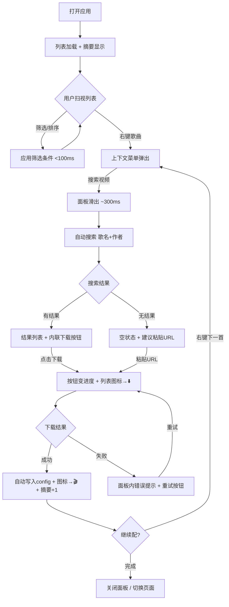
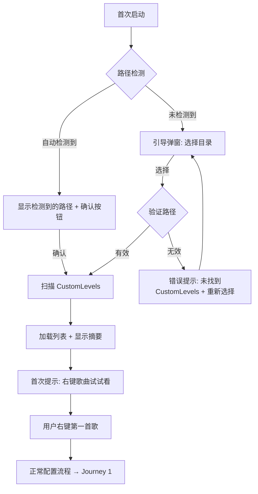
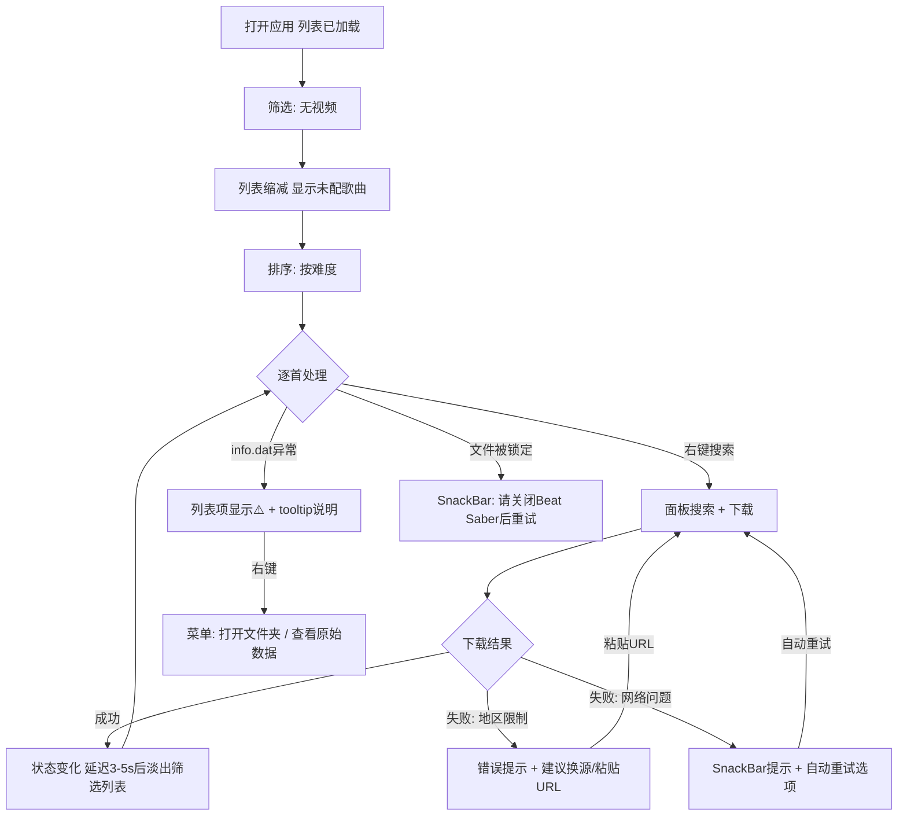
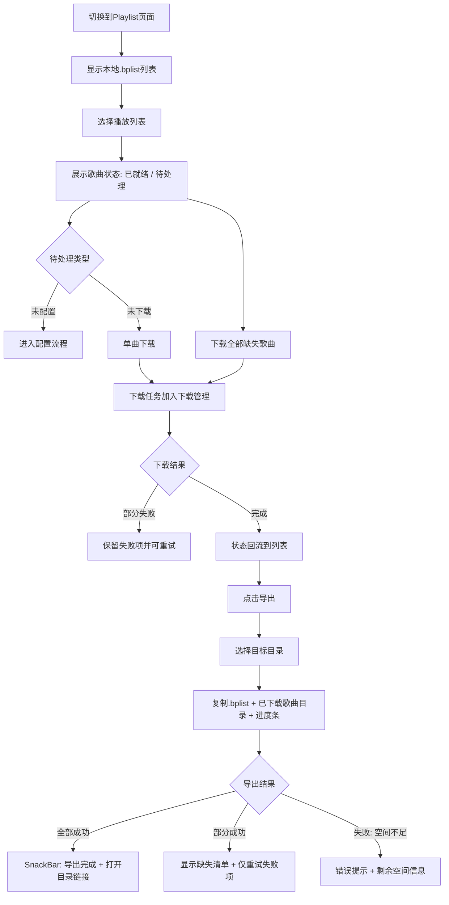

# UX Design Specification - Beat Cinema v2

**Author:** Lihang
**Date:** 2026-03-10

---

## Executive Summary

### Project Vision

Beat Cinema v2 是一个面向 Beat Saber Cinema mod 用户的 Windows 桌面工作台，将关卡浏览、视频搜索/下载、音视频同步校准和播放列表管理整合为一站式体验。UX 设计的核心命题是：让管理 600+ 首自定义关卡的视频配置流程从"碎片化的多工具跳转"变成"一个窗口内的连贯操作"。

已锚定的交互框架（来自架构决策）：
- 主布局：`NavigationRail（左 72px）| 内容区（中 Expanded）| 按需面板（右 ~350px）`
- 页面保持：StatefulShellRoute + IndexedStack，切换页面不丢状态
- 操作入口：右键上下文菜单为主要交互范式
- 视觉基调：Spotify-like 布局，借用用户已有的"左导航 + 中列表 + 右详情"心智模型

### Target Users

**核心用户（创建者本人）：**
- 600+ 自定义关卡的深度 Beat Saber 玩家
- 技术能力中上，熟悉 mod 生态和文件系统操作
- 对操作效率极度敏感，追求最少点击完成任务
- PC 游戏玩家，习惯右键菜单、键盘快捷键等桌面交互范式

**典型新用户：**
- 100-200 首关卡的中度玩家，刚接触 Cinema mod
- 技术能力一般，需要低门槛引导
- 可能不理解"同步校准"等专业概念

**共同特征：**
- Windows 桌面用户，拥有鼠标+键盘+大屏幕
- 作为 Beat Saber 玩家，对进度条、成就感、视觉反馈天然敏感
- 双语环境（中文/英文），搜索平台可能跨 YouTube 和 Bilibili

### Key Design Challenges

**挑战 1：大量关卡的信息密度管理**
500-800 首歌的列表，每首歌有歌名、作者、BPM、多个难度徽章、视频配置状态。如何在不淹没用户的前提下让关键信息一目了然？需要在列表项的视觉复杂度和滚动性能之间找平衡。

**挑战 2：面板交互的心理模型**
右侧面板承载搜索、预览、校准等多种功能。面板内容切换时需要清晰的视觉反馈（标题栏+关闭按钮+过渡动画），让用户感知"内容变了"而不是"出错了"。面板不设历史概念——当前面板即当前操作的上下文。

**挑战 3：同步校准的可理解性**
左右声道分离+偏移滑块对普通玩家是全新概念。设计比喻："左耳听音乐，右耳听视频，拖滑块让它们对齐"。配合简短的动画引导，用直觉替代文字说明。

**挑战 4：错误状态的系统化呈现**
600 首歌里大概率有格式异常的 info.dat。需要系统性的错误视觉语言，而不是逐 case 设计。

**挑战 5：双语弹性布局**
英文普遍比中文长 30-50%。所有文本容器必须以英文长度为基准设计，右键菜单宽度自适应，面板表单标签不使用固定像素约束。

### Design Opportunities

**机会 1：视觉状态实时反馈**
关卡的"无视频→搜索中→下载中→已配置"状态转换贯穿整个使用流程。列表项状态实时、平滑地反映进度，带来强烈的"掌控感"——工具类应用最重要的情感体验。

**机会 2：三层渐进式信息架构**
- 第零层：页面级状态摘要（总数/已配数/下载中）——用户落地时 0.5 秒内建立心理锚点
- 第一层：列表概览——扫一眼的关键信息
- 第二层：右键快速操作——零导航成本
- 第三层：面板深入详情——搜索/预览/校准

**机会 3：Spotify 心智模型复用**
借用用户已熟悉的"左侧导航+中间列表+右侧详情"布局模式，大幅降低学习成本。

**机会 4：情感引导减少选择焦虑**
面对 600 首未配歌曲，用户的第一反应是焦虑。通过"智能推荐起点"（如"最近添加的 20 首新歌"或"你最常玩的 Expert+ 还有 X 首未配"）把选择焦虑转化为引导行动。

**机会 5：搜索平台上下文切换**
搜索面板内的平台切换器（YouTube/Bilibili 图标按钮）替代全局设置，让用户按歌曲语言灵活选择，默认跟随全局但可随时切换。

### UX Design Constraints

**点击路径硬约束：**
核心流程"搜索视频→下载→配置写入"必须在 ≤3 步内完成（PRD 成功标准）。搜索结果应带内联下载按钮，"选择+下载"合并为一步。

**空间布局约束：**
- NavigationRail 固定图标模式（72px），hover 时 tooltip 显示文字
- 窗口最小宽度 1024px，面板打开时内容区 ≥ 600px
- 面板 350px 内需适配两种密度：搜索结果紧凑布局（小缩略图+标题+内联按钮）/ 预览宽松布局（大缩略图+详细信息）

**微交互原则：**
每个用户操作必须在 100ms 内有视觉反馈，即使实际结果需要更长时间。下载完成时列表项状态变化应有微妙的庆祝动效。

**错误严重度分级：**

| 级别 | 场景 | 呈现方式 |
|------|------|---------|
| 静默降级 | info.dat 格式异常 | 列表项显示歌名，难度徽章灰色占位，tooltip "无法解析" |
| 内联提示 | 下载失败 / 搜索超时 | 面板内红色文本 + 重试按钮，不阻断其他操作 |
| 非模态通知 | 文件被锁定 / 网络断开 | 底部 SnackBar，自动消失或手动关闭 |
| 模态确认 | 关闭应用时有活跃下载 | 弹窗确认，用户必须选择 |

**双语弹性原则：**
所有包含文本的 UI 元素以英文长度为基准设计宽度，不使用固定像素值约束文本区域。

### Edge Case Scenarios

| 场景 | 描述 | UX 要求 |
|------|------|---------|
| 空目录 | CustomLevels 为空（刚装游戏） | 引导性空状态，指向"去 BeatSaver 下载歌曲" |
| 超大规模 | 3000+ 首关卡 | 加载指示器 + 筛选/搜索响应预期管理 |
| 路径变更 | 用户在设置中切换 Beat Saber 路径 | 平滑过渡（淡出旧列表 → 加载指示 → 淡入新列表） |
| 搜索无结果 | 搜索关键词无匹配 | 面板空状态提示 + 建议"尝试粘贴 URL 直接下载" |
| 首次使用 | 未设置 Beat Saber 路径 | 引导弹窗，检测常见安装路径 |
| 面板关闭时 | 无面板内容显示 | 内容区自然扩展填满，无视觉残留 |

## Core User Experience

### Defining Experience

**产品定位：** Beat Cinema v2 是一个**资源管理工作台**，不是搜索工具。核心动词是"管理"，不是"搜索"。

**核心操作循环：**
扫视全局状态 → 定位目标歌曲 → 执行操作（搜索/下载/校准） → 确认结果 → 循环

**最频繁的单一操作：** 在列表中定位下一首要处理的歌。列表的视觉分区和筛选能力是体验的基石。

**体验节奏：**
- 扫描（~2s）：浏览列表，决定处理哪首
- 行动（10-30s）：搜索→下载→（校准）
- 确认（~3s）：看到状态变化，获得满足感
- 循环…

每个节奏环节都不可省略。尤其是"确认"环节——即使只是图标的微妙变化，它是用户获得成就感的时刻。

**不可替代价值（超越脚本的理由）：**
1. 视觉反馈——进度条、缩略图、难度徽章，让数据变成可感知的信息
2. 决策辅助——搜索结果带缩略图和时长，用户可快速判断匹配度
3. 同步校准——用人耳判断音视频是否同步，不可脚本化，是产品护城河

### Platform Strategy

**目标平台：** Windows 10/11 桌面应用（Flutter Desktop）

**交互范式：**
- 鼠标+键盘为主要输入方式
- 右键上下文菜单为核心操作入口（符合桌面用户习惯）
- hover 状态作为信息预览层（tooltip、高亮）
- 大屏幕空间利用：三栏布局（Rail + 内容 + 面板）

**离线能力：**
- 完全离线可用：列表浏览/筛选/排序、info.dat 解析、已下载视频预览/试听、Playlist 管理/导出、配置编辑
- 需要网络：视频搜索、视频下载、更新检测

**窗口行为：**
- 尺寸和位置持久化，再次打开恢复上次状态
- 最小窗口宽度约束（保障三栏布局可用性）
- 关闭时优雅终止活跃进程

### Effortless Interactions

**零思考操作：**
- 打开应用 → 列表自动加载并恢复上次筛选/排序状态
- 右键任意歌曲 → 上下文菜单自动适配当前状态（未配→显示"搜索视频"，已配→显示"预览/重新配置"）
- 搜索结果内联下载按钮 → 点击即下载，无需"选择→确认→开始"多步操作
- 下载完成 → 自动写入 cinema-video.json，状态图标自动更新

**消除的传统步骤：**
- 不需要手动编辑 JSON 文件
- 不需要在多个应用间复制粘贴 URL
- 不需要手动刷新列表查看状态变化
- 不需要记住哪首歌已配/未配（视觉状态标记）

**筛选列表中的状态变化处理：**
当用户筛选"未配视频"列表后，某首歌配置完成——采用"延迟消失"策略：状态图标立即变化（用户确认成功），保留 3-5 秒，然后淡出动画移出列表。兼顾筛选准确性和操作确认感。

### Critical Success Moments

**"这比以前好"的瞬间（Make-or-Break）：**

| 时刻 | 描述 | 失败后果 |
|------|------|---------|
| 首次打开列表 | 600 首歌 < 3s 加载完成，难度徽章和状态一目了然 | 用户认为"和 v0.0.3 一样慢"，放弃 |
| 第一次右键操作 | 菜单即时弹出，选项直觉明确 | 用户回退到手动流程 |
| 第一次下载成功 | 列表项状态从"─"变为"🎬"的那一刻 | 如果没有视觉反馈，用户不确定是否成功 |
| 页面切换后返回 | 列表位置、筛选条件、滚动位置完全保持 | "状态丢失"是 v0.0.3 的核心痛点 |
| 同步校准（Growth） | 拖动滑块，听到音乐和视频音频对齐 | 如果延迟>100ms，校准体验崩塌 |

**首次用户成功路径：**
启动 → 路径设置引导 → 列表加载 → 右键一首歌 → 搜索 → 内联下载 → 看到状态变化 = **"我懂了，就这么用"**

### Experience Principles

**Beat Cinema v2 五条核心体验原则：**

1. **5 秒定位** — 打开应用到开始操作不超过 5 秒。页面级摘要 + 筛选器让用户瞬间建立心理锚点，知道"该做什么"。

2. **3 步完成** — 核心配置流程（搜索→下载→写入）≤ 3 步。搜索结果带内联下载按钮，合并"选择"和"开始下载"为一步。

3. **实时感知** — 每个状态变化都有即时视觉反馈，零"猜测"时刻。100ms 内响应用户操作，下载完成有微妙庆祝动效。

4. **节奏循环** — 扫描(2s)→行动(10-30s)→确认(3s)的流畅节奏。不打断用户的操作节奏，不强制跳转或模态阻断（除非必须决策）。

5. **超越脚本** — 每个交互都提供命令行无法给予的视觉/听觉价值。如果一个操作在 Beat Cinema 里和在终端里体验一样，说明它没有设计到位。

## Desired Emotional Response

### Primary Emotional Goals

1. **掌控感（Empowered）** — 面对数百首关卡不焦虑，通过摘要+筛选感知全局进度，用户始终知道"我在哪、做了多少、还剩多少"。
2. **效率愉悦（Productive Flow）** — 操作节奏流畅不卡顿，每步都有即时反馈，用户进入"心流"状态而不被工具打断。
3. **渐进成就（Incremental Achievement）** — 每配完一首歌都是可感知的进步。对 Beat Saber 玩家来说，这和 Full Combo 的成就感同源：逐个击破，积少成多。

### Emotional Journey Mapping

| 阶段 | 用户状态 | 目标情感 | 设计手段 |
|------|---------|---------|---------|
| 打开应用 | "又要做事了"的任务感 | → 掌控感："只有 20 首要处理" | 摘要栏数字化呈现进度 |
| 浏览列表 | 面对大量信息 | → 清晰感：一眼区分状态 | 难度徽章+状态图标视觉分区 |
| 搜索视频 | 等待结果 | → 信任感：系统在工作 | 搜索加载指示器 + 面板打开动画 |
| 下载完成 | 操作结束 | → 成就感：又搞定一首 | 状态图标变化微动效 + 摘要数字更新 |
| 遇到错误 | 沮丧/困惑 | → 信心感：知道怎么解决 | "为什么+怎么办"双信息 + 重试按钮 |
| 同步校准 | 专注调节 | → 创造性满足："就是这个！" | 实时音频反馈 + 滑块视觉 tick |
| 完成一批 | 回顾成果 | → 满足感：进度可见 | 摘要栏数字变化，筛选列表收缩 |
| 再次打开 | 回归熟悉 | → 安心感：一切都在 | 恢复上次窗口状态/筛选/滚动位置 |

### Micro-Emotions

**关键微情感对：**

| 正向（目标） | 负向（避免） | 触发场景 | 防御手段 |
|-------------|-------------|---------|---------|
| 信心 | 困惑 | 每次操作后 | 100ms 内视觉反馈确认操作已接收 |
| 信任 | 怀疑 | 异步操作等待中 | 进度指示器，永远不出现"卡住"的沉默 |
| 满足 | 挫败 | 下载/配置完成时 | 状态变化微动效，摘要实时更新 |
| 安心 | 焦虑 | 切换页面/关闭面板 | 状态持久化，返回时一切如故 |
| 理解 | 无助 | 出错时 | 错误消息三要素：是什么 + 为什么 + 怎么办 |

### Design Implications

| 情感目标 | 设计策略 |
|---------|---------|
| 掌控感 | 页面摘要栏、一目了然的状态图标系统、筛选器作为"导航工具"而非"高级功能" |
| 效率愉悦 | 100ms 操作反馈承诺、内联按钮减少步骤、右键菜单零导航成本 |
| 渐进成就 | 状态变化微动效、摘要数字实时更新、筛选列表延迟消失(3-5s)确认窗口 |
| 错误时的信心 | 四级错误呈现（静默降级/内联/SnackBar/模态）、每条错误带行动建议 |
| 校准的创造性满足 | 实时音频反馈无延迟、滑块拖拽的视觉刻度 tick、明确的"已对齐"确认状态 |
| 再次打开的安心 | 窗口位置/尺寸持久化、列表筛选/排序/滚动位置恢复、面板状态保持 |

### Emotional Design Principles

1. **进度可见** — 让用户随时知道"完成了多少，还剩多少"。摘要栏是情感锚点，不是装饰。

2. **错误可解** — 每条错误都带行动建议，用户永远不会走进死胡同。把"出错了"转化为"试试这样做"。

3. **节奏不断** — 操作循环中不插入不必要的确认弹窗或加载等待。只有"关闭应用时有活跃下载"这一个场景使用模态确认。

4. **庆祝微小** — 成功时的反馈可感知但不夸张。图标变化 + 微动效，不是烟花和弹窗。尊重用户的专注力。

## UX Pattern Analysis & Inspiration

### Inspiring Products Analysis

#### Spotify Desktop — 布局与导航范式

**核心 UX 优势：**
- 三栏布局（左侧导航 + 中间内容 + 右侧详情）已成为桌面媒体管理的事实标准
- 左侧导航极简：图标+文字，不超过 8 项，视觉噪音极低
- 列表项信息密度高但不杂乱：专辑封面（32px）+ 歌名 + 艺术家 + 时长，一行搞定
- 右侧面板按需展开，不影响主内容区浏览
- 页面切换保持播放状态，用户心理模型稳定

**可借鉴点：**
- 三栏比例分配策略：固定侧边栏 + 弹性内容 + 可收起详情面板
- 列表项紧凑布局：关键信息一行，次要信息通过 hover 或展开获取
- 全局播放栏（底部）独立于页面导航——对 Beat Cinema 的启示：下载进度可以有类似的"全局状态指示"

#### VS Code / Cursor — 桌面工具交互范式

**核心 UX 优势：**
- 右键菜单是主要操作入口，菜单项根据上下文动态变化
- 侧边栏可在多种面板间切换（文件、搜索、Git），面板切换即时无延迟
- 状态栏（底部）始终显示全局信息：行号、编码、Git 分支——信息密度高但不干扰
- 命令面板（Ctrl+Shift+P）提供键盘优先的快速访问

**可借鉴点：**
- 右键菜单的上下文感知设计（选中不同类型的项目显示不同菜单）
- 底部状态栏模式：适合放下载队列摘要或全局状态
- 侧边面板的切换模式：点击同一图标关闭面板，点击不同图标切换内容

#### Beat Saber 歌曲选择界面 — 目标用户的心智模型

**核心 UX 优势：**
- 用户已熟悉的交互：歌曲列表 + 难度选择 + 实时预览
- 难度用颜色编码（Easy=绿、Normal=黄、Hard=橙、Expert=红、Expert+=紫）——玩家的"母语"
- 滚动列表 + 搜索/筛选是玩家管理大量歌曲的已有习惯

**可借鉴点：**
- 难度颜色编码必须与 Beat Saber 一致——用户已建立的色彩映射
- 列表+筛选+搜索的交互三件套是玩家的舒适区

#### ModAssistant — Beat Saber 工具生态参考

**核心 UX 优势：**
- 简单直接：列表 + 复选框 + 安装按钮
- 状态标记清晰：已安装/可更新/不兼容

**可借鉴点（反面）：**
- UI 过于简陋，缺乏视觉层次——Beat Cinema 应比这更精致
- 无面板/详情概念——说明社区工具的 UX 标准不高，超越空间大

### Transferable UX Patterns

**导航模式：**

| 模式 | 来源 | 适用场景 |
|------|------|---------|
| 固定图标 Rail + tooltip | Material 3 / Spotify | Beat Cinema 主导航，3-4 个 tab |
| 面板切换（点击同图标=关闭，不同图标=切换） | VS Code 侧边栏 | 右侧面板在搜索/预览/校准间切换 |
| 全局状态栏 | VS Code 底部栏 | 下载队列摘要 + 活跃任务数 |

**交互模式：**

| 模式 | 来源 | 适用场景 |
|------|------|---------|
| 上下文感知右键菜单 | VS Code / Windows Explorer | 歌曲右键：根据视频状态动态菜单项 |
| 内联操作按钮（hover 显示） | Spotify 列表项 hover 出播放按钮 | 列表项 hover 显示"搜索视频"快捷按钮 |
| 搜索结果内联操作 | App Store "获取"按钮 | 搜索结果每项带"下载"按钮，一步到位 |
| 拖拽滑块实时反馈 | 音频编辑器（Audacity 等） | 同步校准偏移滑块 |

**视觉模式：**

| 模式 | 来源 | 适用场景 |
|------|------|---------|
| 颜色编码标签/徽章 | Beat Saber 难度颜色 | 难度徽章直接复用玩家已知色彩 |
| 状态图标系统 | Git 图标（●未跟踪 ✓已提交） | 🎬已配 / ⬇️下载中 / ─未配 / ⚠️异常 |
| 暗色主题 | Spotify / VS Code | 与 Beat Saber 游戏氛围一致，减少视觉疲劳 |
| 紧凑列表 + 足够行高 | Spotify 歌曲列表 | 信息密集但不拥挤，单行 ~48px |

### Anti-Patterns to Avoid

| 反模式 | 问题 | Beat Cinema 对策 |
|--------|------|-----------------|
| 信息过载列表 | 一次显示所有字段导致视觉混乱 | 主信息一行显示，次要信息 hover/面板 |
| 模态弹窗地狱 | 每个操作都需要确认对话框 | 仅"关闭时有活跃下载"一个场景用模态 |
| 全局设置埋太深 | 关键配置需要多级菜单才能到达 | Beat Saber 路径在首次使用时引导，后续 Settings 页直达 |
| 加载时 UI 冻结 | 长时间操作阻塞主线程 | Isolate 解析 + Stream 进度，UI 始终响应 |
| 错误信息只给代码 | "Error: EBUSY" 对用户无意义 | 每条错误转化为人话 + 行动建议 |
| 无反馈的异步操作 | 点击按钮后没有任何视觉变化 | 100ms 内必有反馈，即使只是按钮状态变化 |
| 亮色主题在游戏工具中 | 与游戏生态的暗色氛围格格不入 | 默认暗色主题，与 Beat Saber 视觉语言一致 |

### Design Inspiration Strategy

**直接采用：**
- Spotify 三栏布局比例（Rail 72px + 弹性内容 + 面板 350px）
- Beat Saber 难度颜色编码（绿/黄/橙/红/紫）
- VS Code 式右键上下文感知菜单
- Material 3 暗色主题基调

**适配修改：**
- Spotify 底部播放栏 → 底部下载状态栏（非固定，仅有活跃下载时显示）
- VS Code 面板切换逻辑 → 简化为搜索/预览/校准三种面板类型
- Spotify 列表 hover 播放按钮 → hover 显示"搜索视频"快捷入口

**明确避免：**
- ModAssistant 的简陋视觉风格（Beat Cinema 需要更精致的 UI）
- Web 应用的多 Tab 导航模式（桌面应用用 Rail，不用 Tab Bar）
- 移动端的底部导航栏（`BottomNavigationBar` 已在 Project Context 中禁止）

## Design System Foundation

### Design System Choice

**Material 3 暗色主题 + 自定义语义层**（Flutter 原生设计系统）

```
设计层级：
├── Layer 0: Material 3 基础（ColorScheme、Typography、组件库）
├── Layer 1: 暗色主题定制（手动深色背景 + seed 紫色强调色阶）
├── Layer 2: Beat Saber 语义色（静态常量类，难度颜色 + 状态颜色）
└── Layer 3: 自定义组件（上限 5 个，定义四态交互）
```

### Rationale for Selection

- **开发效率：** 独立开发者，Material 3 提供现成的无障碍组件，无需从零构建
- **Flutter 亲和性：** Material Design 是 Flutter 支持最完整的设计系统，无需第三方 UI 库
- **游戏生态一致性：** 暗色主题与 Beat Saber 视觉氛围一致，降低玩家认知切换
- **可维护性：** 自定义组件上限 5 个，其余一律用 Material 3 原生，最小化维护负担
- **品牌表达：** seed color 紫色 `Color.fromARGB(255, 123, 0, 255)` 保持项目视觉识别

### Implementation Approach

**Layer 1 — 暗色主题策略：**
- 背景色：手动定义深色 `#121212`（纯暗）到 `#1A1A2E`（略带紫调），不使用 `fromSeed` 自动生成的浅灰暗色
- 强调色：`ColorScheme.fromSeed(seedColor: purple, brightness: Brightness.dark)` 生成紫色色阶用于按钮、选中态、链接等
- 表面色：列表项 hover 态 `#2A2A2A`，选中态使用 seed 紫色的低透明度叠加

**Layer 2 — Beat Saber 语义色：**

存放方式：静态常量类（非 ThemeExtension），因为难度色是领域固定语义，不随主题变化。

```dart
class BeatSaberColors {
  static const Color easy = Color(0xFF3CB371);       // 绿
  static const Color normal = Color(0xFFFFD700);     // 黄
  static const Color hard = Color(0xFFFF8C00);       // 橙
  static const Color expert = Color(0xFFFF4444);     // 红
  static const Color expertPlus = Color(0xFF8B00FF); // 紫
}
```

呈现方式：**小圆点（8-10px）**，非背景色块。小圆点在任何背景色上都保持可读性（暗色背景、hover 高亮、选中态均可辨识）。

**Layer 3 — 自定义组件清单（上限 5 个）：**

| 组件 | 用途 | 位置 |
|------|------|------|
| `LevelListTile` | 歌曲列表项（歌名+作者+难度圆点+状态图标，~48-56px 行高） | Modules/CustomLevels/ |
| `DifficultyBadge` | 难度颜色小圆点（8-10px，带 tooltip 显示难度名称） | Common/ |
| `StatusIndicator` | 视频配置状态图标（已配/下载中/未配/异常） | Common/ |
| `PanelHost` | 右侧面板容器（AnimatedContainer + 标题栏 + 关闭按钮） | Modules/Panel/ |
| `ContextMenuRegion` | 右键菜单区域封装（GestureDetector + showMenu） | Common/ |

其余所有 UI 一律使用 Material 3 原生组件 + ThemeData 定制。禁止创建"换皮组件"（如 CustomButton、CustomCard）。

### Customization Strategy

**自定义组件交互态规范：**

所有 5 个自定义组件必须定义以下四种交互态：

| 状态 | 视觉表现 |
|------|---------|
| Normal | 默认外观，暗色背景上的标准呈现 |
| Hover | 背景微亮（`#2A2A2A`），可显示额外信息（如快捷操作按钮） |
| Pressed | 背景进一步变亮或使用 seed 紫色低透明度叠加 |
| Disabled | 透明度降低（~38%），移除交互反馈 |

**Typography 规范：**
- 使用 Material 3 Typography scale，不自定义字体
- 列表主标题：`titleMedium`（歌名）
- 列表副标题：`bodySmall`（作者/BPM）
- 面板标题：`titleLarge`
- 摘要栏：`labelLarge`

**间距规范：**
- 统一使用 8px 网格系统（padding/margin 为 8 的倍数：8、16、24、32）
- 列表项内部 padding：水平 16px，垂直 8px
- 面板内部 padding：16px
- 组件间距：8px（紧凑）或 16px（标准）

## Defining Experience

### Core Defining Interaction

**"右键搜，一键配"** — 右键一首歌 → 面板弹出搜索结果 → 点击下载 → 状态图标自动变化。

这个交互是 Beat Cinema v2 的产品灵魂。用户描述给朋友时会说："我右键一首歌，选个视频点下载，自动就配好了。"

五条体验原则在此集中体现：
- 右键 = 零导航（5 秒定位）
- 面板弹出 = 即时反馈（实时感知）
- 内联下载 = 最少步骤（3 步完成）
- 状态变化 = 成就确认（节奏循环）
- 缩略图+时长辅助选择 = 不可脚本化（超越脚本）

### User Mental Model

**当前方式（v0.0.3 / 手动流程）：**

| 步骤 | 操作 | 工具 | 痛点 |
|------|------|------|------|
| 1 | 找到歌曲目录 | 文件管理器 | 需要记住路径 |
| 2 | 搜索匹配视频 | 浏览器 YouTube/Bilibili | 切换应用，手动输入歌名 |
| 3 | 下载视频 | 命令行 yt-dlp | 需要记住命令和参数 |
| 4 | 移动文件到正确目录 | 文件管理器 | 手动拷贝 |
| 5 | 编辑 cinema-video.json | 文本编辑器 | 手动编写 JSON，易出错 |
| 6 | 验证配置 | 启动游戏 | 不知道是否正确直到进游戏 |

**Beat Cinema v2 心智模型：**

| 步骤 | 操作 | 反馈 |
|------|------|------|
| 1 | 右键歌曲 → "搜索视频" | 面板滑出，自动搜索 |
| 2 | 点击搜索结果的"下载"按钮 | 按钮变进度条，列表图标变 ⬇️ |
| 3 | （自动完成）下载+写入配置 | 列表图标变 🎬，摘要 +1 |

从 6 步 → 3 步（用户操作 2 步 + 系统自动 1 步），且全程不离开应用。

### Success Criteria

**核心交互成功的判定标准：**

| 标准 | 量化指标 |
|------|---------|
| 操作步骤 | 从右键到配置写入 ≤ 3 步 |
| 面板响应 | 右键→面板出现 < 300ms |
| 搜索响应 | 发起搜索→首条结果显示 < 3s（网络正常） |
| 下载反馈 | 点击下载→进度指示出现 < 100ms |
| 状态更新 | 下载完成→列表图标变化 < 500ms |
| 零配置 | cinema-video.json 自动写入，用户无需任何手动编辑 |
| 可恢复 | 下载失败时，面板内显示错误原因+重试按钮 |

**用户说"this just works"的时刻：** 点击下载后什么都不用管，列表里那首歌的图标自己变了。

### Novel UX Patterns

**模式分析：组合已有模式的创新**

Beat Cinema v2 的核心交互不需要发明新模式，而是将三个成熟模式**串联**成一个连贯流程：

| 模式 | 来源 | 在 Beat Cinema 中的用法 |
|------|------|----------------------|
| 右键上下文菜单 | Windows / VS Code | 触发操作入口 |
| 侧面板搜索 | VS Code / Spotify | 搜索结果展示 |
| 内联操作按钮 | App Store "获取" | 搜索结果一键下载 |

**创新点不在交互本身，在于串联的无缝性：** 右键 → 面板自动搜索 → 下载自动写入配置。每一步都是用户熟悉的模式，但串联后消除了所有中间步骤。

**需要教育用户的唯一新模式：** 同步校准（Growth 阶段）。"左耳音乐 + 右耳视频 + 拖滑块对齐"——需要首次使用时的简短动画引导。

### Experience Mechanics

**1. Initiation — 触发方式：**

| 触发路径 | 交互 | 优先级 |
|---------|------|--------|
| 右键菜单 | 右键歌曲 → "搜索视频" | 主要入口 |
| Hover 快捷 | 列表项 hover → 搜索图标按钮 | 辅助入口 |
| URL 粘贴 | 面板搜索框粘贴视频 URL | 降级方案 |

**2. Interaction — 面板搜索流程：**

```
用户右键 "搜索视频"
  → 面板滑出 (~300ms AnimatedContainer)
  → 面板标题: "搜索视频 - {歌名}"
  → 搜索框预填: "{歌名} {作者}"（可编辑）
  → 平台切换器: [YouTube] [Bilibili]（默认跟随全局设置）
  → 自动发起搜索
  → 加载态: 骨架屏 (3-5 条占位)
  → 结果列表:
      ┌─────────────────────────────────┐
      │ [缩略图] 标题           [下载▶] │
      │          时长 · 频道            │
      ├─────────────────────────────────┤
      │ [缩略图] 标题           [下载▶] │
      │          时长 · 频道            │
      └─────────────────────────────────┘
```

**3. Feedback — 下载反馈链：**

```
点击 [下载▶]
  → 按钮立即变为微型进度环 (< 100ms)
  → 列表中歌曲状态图标: ─ → ⬇️
  → 面板内该结果项显示进度百分比
  → 下载完成:
      → 自动写入 cinema-video.json (原子写入)
      → 列表状态图标: ⬇️ → 🎬 (微动效, ~500ms)
      → 摘要栏 "已配" 数字 +1
      → 面板内该结果项显示 ✓ 已完成
```

**4. Completion — 用户知道"搞定了"：**

- 列表图标变化（⬇️ → 🎬）是最明确的完成信号
- 摘要栏数字更新提供全局进度感
- 用户可以立即右键下一首歌，无需关闭面板
- 面板内容在右键新歌时自动切换为新歌的搜索

## Visual Design Foundation

### Color System

**主题基调：** 暗色优先，紫调深色背景（Beat Saber 霓虹氛围）

**Seed Color：** `Color.fromARGB(255, 123, 0, 255)` — 品牌紫，用于生成 Material 3 强调色阶

**Surface 层级体系：**

| 层级 | 用途 | 色值 | 说明 |
|------|------|------|------|
| Surface 0 | NavigationRail 背景 | `#141422` | 最深，视觉锚定 |
| Surface 1 | 主内容区背景 | `#1A1A2E` | 基底，紫调深色 |
| Surface 2 | 面板背景 / Card | `#222236` | 微微浮起，区分层次 |
| Surface 3 | Hover 高亮 | `#2A2A42` | 交互反馈 |
| Surface 4 | 选中态 / Active | seed 紫 10% 透明度叠加 | 强调当前焦点 |

**语义状态色：**

| 语义 | 色值 | 用途 | 选择理由 |
|------|------|------|---------|
| 成功 | `#9B59FF` | 下载完成、配置写入成功 | 偏亮紫，品牌关联+成就感，与 Expert+ `#8B00FF` 有区分 |
| 警告 | `#FFA000` | info.dat 解析异常、待处理 | 琥珀色，不与 Hard 橙 `#FF8C00` 撞色 |
| 错误 | `#CF6679` | 下载失败、文件写入失败 | Material Dark 标准错误色 |
| 信息 | `#80CBC4` | 提示、引导、中性通知 | 淡蓝绿，不与任何难度色冲突 |

**Beat Saber 难度色（领域语义，固定不变）：**

| 难度 | 色值 | 呈现方式 |
|------|------|---------|
| Easy | `#3CB371` | 小圆点 8-10px |
| Normal | `#FFD700` | 小圆点 8-10px |
| Hard | `#FF8C00` | 小圆点 8-10px |
| Expert | `#FF4444` | 小圆点 8-10px |
| Expert+ | `#8B00FF` | 小圆点 8-10px + 1px 浅灰描边（防止紫调背景撞色） |

**前景文字色：**

| 用途 | 色值 | 对比度要求 |
|------|------|---------|
| 主要文字 | `#E6E1E5` | 在 Surface 1 上 ≥ 7:1 (AAA) |
| 次要文字 | `#CAC4D0` | 在 Surface 1 上 ≥ 4.5:1 (AA) |
| 禁用文字 | `#49454F` | 视觉降级，不要求对比度 |

### Typography System

**基础：** Material 3 Typography scale，不自定义字体（使用系统默认）

**层级应用：**

| 用途 | Style | 示例内容 |
|------|-------|---------|
| 页面标题 | `headlineMedium` | "自定义关卡" |
| 面板标题 | `titleLarge` | "搜索视频 - Crystallized" |
| 摘要栏 | `labelLarge` | "600首 · 200已配 · 3下载中" |
| 列表主标题 | `titleMedium` | 歌名 "Crystallized" |
| 列表副标题 | `bodySmall` | 作者 "Camellia" · BPM 180 |
| 按钮文字 | `labelLarge` | "下载" "搜索" |
| 面板正文 | `bodyMedium` | 搜索结果描述、错误信息 |
| Tooltip | `bodySmall` | "Expert+ · 无法解析关卡信息" |

**排版原则：**
- 歌名作为列表中最重要的信息，使用 `titleMedium` 确保一眼可见
- 副信息（作者、BPM）用 `bodySmall` + 次要文字色，降低视觉权重
- 面板内文字密度可以更高（用户已决定深入查看），正文用 `bodyMedium`

### Spacing & Layout Foundation

**网格系统：** 8px 基准

所有 padding、margin、间距均为 8 的倍数：4（半格，仅用于极紧凑场景）、8、16、24、32。

**列表项规范：**

| 维度 | 数值 | 说明 |
|------|------|------|
| 行高 | 48px | 紧凑高效，匹配 Spotify 密度 |
| 水平内边距 | 16px | 左右各 16px |
| 垂直内边距 | 8px | 上下各 8px，内容高度 32px |
| 难度圆点间距 | 4px | 圆点之间极紧凑 |
| 状态图标位置 | 尾部，右对齐 | 与难度圆点保持 16px 间距 |

**布局分区尺寸：**

| 区域 | 宽度 | 约束 |
|------|------|------|
| NavigationRail | 72px 固定 | 图标模式，hover tooltip |
| 内容区 | Expanded (弹性) | 最小 ~600px |
| 右侧面板 | 350px（开）/ 0px（关） | AnimatedContainer 动画切换 |
| 摘要栏 | 内容区全宽 | 高度 ~40px，紧贴列表顶部 |

**最小窗口宽度：** 1024px（72 + 602 + 350 = 1024，面板全开时内容区 ≥ 602px）

**组件间距规范：**

| 场景 | 间距 | 说明 |
|------|------|------|
| 列表项之间 | 0px（无间距） | 紧密列表，靠 hover 高亮区分边界 |
| 面板内元素 | 16px | 标准间距 |
| 搜索结果项之间 | 8px | 面板内紧凑排列 |
| 摘要栏与列表 | 8px | 视觉分隔但不割裂 |
| 筛选栏与列表 | 8px | 紧跟摘要栏下方 |

### Accessibility Considerations

**对比度标准：**
- 主要文字：WCAG AAA (≥ 7:1)
- 次要文字：WCAG AA (≥ 4.5:1)
- 交互元素（按钮、链接）：WCAG AA (≥ 4.5:1)
- 难度圆点：作为装饰性色彩标记，配合 tooltip 文字说明确保信息可获取

**色觉辅助：**
- 难度区分不仅依赖颜色：tooltip 显示难度名称文字
- 视频状态不仅依赖图标颜色：配合形状差异（🎬/⬇️/─/⚠️ 各自形状不同）
- 成功/警告/错误文本始终带文字说明，不仅靠颜色

**交互可访问性：**
- 所有可点击元素有可感知的 hover/focus 态
- 右键菜单可通过键盘 Shift+F10 触发（Flutter 原生支持）
- Tab 键可在列表项间导航（Material 3 默认行为）

## Design Direction Decision

### Design Directions Explored

三个视觉方向在共同的三栏布局框架内探索了不同的视觉风格：

| 方向 | 风格 | 层级手段 | 信息密度 | 游戏氛围 |
|------|------|---------|---------|---------|
| A 极简工具 | 无分隔线/无阴影 | 间距+字重 | 最高 | 弱 |
| B 卡片分层 | Card 包裹+阴影 | Surface 层级 | 中等 | 中 |
| C 沉浸霓虹 | 品牌紫指示条+边线 | 色彩指示 | 高 | 强 |

### Chosen Direction

**方向 C：沉浸霓虹风（Neon Immersive）**

核心视觉语言：
- **选中行紫色左侧指示条：** 列表中当前选中/焦点行左侧显示 3-4px 品牌紫色竖条，明确标识"你在这里"
- **面板紫色左边线：** 右侧面板用紫色左侧边线（2px）与内容区区分，同时标识"这是面板内容"
- **进度条紫色填充：** 下载进度使用品牌紫色填充条，与整体色调统一
- **无 Card 包裹：** 列表区不使用 Card，靠 Surface 层级的色差区分背景层次（Rail < 内容区 < 面板）
- **摘要栏分隔线：** 摘要栏底部一条细分隔线（Surface 3 色），与列表视觉分离

### Design Rationale

1. **游戏生态归属感：** 紫色指示条和进度条延续 Beat Saber 的霓虹视觉语言，用户打开 Beat Cinema 时感觉"这属于 Beat Saber 的世界"
2. **高信息密度：** 不使用 Card 包裹避免了内边距浪费空间，列表在 48px 行高下保持最大信息密度
3. **清晰的空间层级：** Rail（Surface 0 最深）→ 内容区（Surface 1）→ 面板（Surface 2 浮起）通过色差建立自然深度
4. **低开发复杂度：** 紫色指示条仅需 `Container` 的 `decoration.border.left`，无需自定义绘制
5. **品牌一致性：** 紫色作为唯一的强调色贯穿所有交互元素（选中态、进度、成功状态），强化视觉识别

### Implementation Approach

**视觉元素到 Flutter 组件映射：**

| 视觉元素 | Flutter 实现 | 说明 |
|---------|-------------|------|
| 选中行紫色左侧条 | `Container` + `BoxDecoration(border: Border(left: ...))` | 选中时 3px 紫色，未选中时 3px 透明 |
| 面板紫色左边线 | `PanelHost` 的 `decoration` | 2px 紫色左边框 |
| Surface 层级背景 | `Theme.of(context).colorScheme` 自定义 + `Container` color | 5 层 Surface 色值已在视觉基础中定义 |
| 下载进度条 | `LinearProgressIndicator` + `valueColor: seed purple` | Material 3 原生组件着色 |
| 摘要栏分隔线 | `Divider` + Surface 3 颜色 | 0.5px 细线 |
| Hover 高亮 | `InkWell` + `hoverColor: Surface 3` | Material 3 原生交互 |
| 难度圆点 | `DifficultyBadge` 自定义组件 | 8-10px 圆点，Expert+ 加描边 |

**视觉风格关键词（供后续设计参考）：**
暗沉底色、霓虹紫强调、紧凑列表、无边框无阴影、色差分层、微动效确认

## User Journey Flows

### Journey 1: 日常视频配置（核心流程）

**入口：** 打开应用 → 列表已加载
**目标：** 为选定歌曲配置 Cinema 视频



**关键交互细节：**
- 右键→面板打开自动搜索，搜索词预填为"歌名 作者"（可编辑）
- 搜索结果每项：小缩略图 + 标题 + 时长 + 频道 + 内联下载按钮
- 点击下载后按钮立即（<100ms）变为微型进度环
- 下载完成自动写入 cinema-video.json（原子写入），无需用户确认
- 右键新歌时面板自动切换为新歌的搜索上下文

### Journey 2: 首次使用引导（Growth）

**入口：** 首次启动应用
**目标：** 完成基础配置，成功配置第一首歌



**关键交互细节：**
- 路径自动检测（Steam 默认路径 + Registry 查询）优先，减少手动操作
- 路径无效时错误提示说明"需要选择包含 CustomLevels 文件夹的 Beat Saber 安装目录"
- 首次加载完成后显示一次性引导 tooltip："右键任意歌曲开始配置视频"
- 引导提示点击后消失，不再出现

### Journey 3: 批量管理与错误处理

**入口：** 打开应用，列表已加载
**目标：** 批量处理未配视频的歌曲，处理各种异常



**关键交互细节：**
- 筛选"无视频"后列表立即缩减（<100ms），摘要栏更新显示筛选结果数
- 配完一首后状态变化（─→🎬），保留 3-5 秒后淡出筛选列表
- info.dat 异常的歌曲显示⚠️图标 + 灰色难度占位，不影响其他歌曲操作
- 错误不阻断：某首歌的失败不影响继续处理下一首

### Journey 4: Playlist 管理、补全下载与导出（Growth）

**入口：** 切换到 Playlist 页面
**目标：** 查看播放列表状态，补全未下载/未配置歌曲，完成可恢复导出



**关键交互细节：**
- 页面切换保持状态（IndexedStack），返回 Playlist 页时恢复上次选择
- Playlist 列表项状态统一为“已就绪 / 待处理”，待处理支持细分（未配置、未下载）
- 未下载歌曲支持“单曲下载”；并提供“下载全部缺失歌曲”（可选“同时更新已存在”）
- 下载任务在 1 秒内进入下载管理并可观察状态变化
- 导出复制 `.bplist` 与已下载歌曲目录，支持部分成功，不因个别失败中断整体流程
- 导出完成后展示结果摘要，并支持“仅重试失败项”

### Cross-Journey Patterns

| 模式 | 出现位置 | 标准化行为 |
|------|---------|---------|
| 右键→面板操作 | J1, J3, J4 | 右键触发 → 面板滑出(~300ms) → 自动填充上下文 → 内联操作 |
| 错误→恢复 | J1, J3 | 错误分级呈现 → "为什么+怎么办" → 重试/替代方案 |
| 状态变化反馈 | J1, J3 | 图标微动效 → 摘要数字更新 → 筛选列表延迟消失(3-5s) |
| 页面切换保持 | J4 | IndexedStack → 滚动位置/筛选/面板状态全部保持 |
| 空状态引导 | J1, J2 | 说明文字 + 建议下一步行动 + 可能的替代方案 |

### Flow Optimization Principles

1. **搜索自动化：** 右键"搜索视频"时自动用歌名+作者搜索，用户不需要手动输入
2. **配置零操作：** 下载完成后自动写入 cinema-video.json，用户无需任何确认
3. **错误不阻断：** 某首歌的错误不影响其他歌曲的操作继续
4. **面板上下文切换：** 右键新歌时面板自动切换为新歌搜索，无需关闭再打开
5. **渐进降级：** URL 粘贴作为搜索失败的降级方案，始终保持可操作性

## Component Strategy

### Design System Components

**Material 3 原生组件直接使用（仅 ThemeData 着色）：**

| 需求 | Material 3 组件 |
|------|----------------|
| 侧边导航 | `NavigationRail` |
| 搜索框 | `SearchBar` / `TextField` |
| 筛选 | `DropdownMenu` / `FilterChip` |
| 按钮 | `IconButton` / `FilledButton` |
| 进度 | `LinearProgressIndicator` / `CircularProgressIndicator` |
| 通知 | `SnackBar` |
| 弹窗 | `AlertDialog` / `Dialog` |
| 提示 | `Tooltip` |
| 分隔 | `Divider` |
| 菜单 | `PopupMenuButton` |
| 文件选择 | `file_picker`（原生系统对话框） |

### Custom Components

**自定义组件上限 5 个，全部详细规格如下：**

#### LevelListTile

- **用途：** 歌曲列表单行项（歌名、作者、难度、视频状态）
- **布局：** `Row [ 紫色选中条(3px) | 歌名+作者(Expanded) | 难度圆点组 | 状态图标 ]`
- **高度：** 48px 固定
- **States：** Normal(Surface 1) / Hover(Surface 3) / Selected(紫色左条+Surface 4) / Disabled(38%透明度)
- **交互：** 单击选中，右键弹菜单，hover 可选显示搜索快捷按钮
- **Phase：** MVP Sprint 1

#### DifficultyBadge

- **用途：** 显示单个难度等级的彩色小圆点
- **布局：** 8px 圆形 Container，Expert+ 加 1px 浅灰描边
- **Tooltip：** hover 显示难度名称文字（走 L10n）
- **States：** Normal(对应颜色) / Disabled(灰色占位，info.dat 解析失败)
- **变体：** 5 种难度颜色，由 BeatSaberColors 常量驱动
- **Phase：** MVP Sprint 1

#### StatusIndicator

- **用途：** 显示歌曲的视频配置状态
- **图标映射：** 已配(成功紫图标) / 下载中(品牌紫+旋转动画) / 未配(次要色短横线) / 异常(警告琥珀三角)
- **尺寸：** 16x16px
- **States：** 静态(已配/未配/异常) / 动态(下载中—旋转或进度)
- **动效：** ⬇️→🎬 状态变化时微妙缩放弹跳（~500ms）
- **Phase：** MVP Sprint 1

#### PanelHost

- **用途：** 右侧面板容器，承载搜索/预览/校准等不同内容
- **布局：** `AnimatedContainer [ 紫色左边线(2px) | Column [ 标题栏 + 关闭按钮 | Divider | 内容区(Expanded) ] ]`
- **宽度：** 关闭 0px / 打开 350px，动画 ~300ms
- **背景：** Surface 2
- **States：** Closed(宽度0) / Open(宽度350) / Switching(内容切换时标题变化)
- **交互：** 关闭按钮 / 右键新歌自动切换内容 / Esc 键关闭
- **Phase：** MVP Sprint 2

#### ContextMenuRegion

- **用途：** 封装右键菜单区域
- **API：** `ContextMenuRegion(menuItems: (item) => [...], child: Widget)`
- **菜单项：** 动态生成，根据歌曲状态显示不同选项
- **文本：** 全部走 L10n（en/zh）
- **键盘：** Shift+F10 触发（Flutter 原生）
- **Phase：** MVP Sprint 0

### Component Implementation Strategy

**原则：**
- 自定义组件仅此 5 个，不轻易增加
- 新增 UI 需求首先尝试 Material 3 原生组件 + ThemeData 定制
- 所有自定义组件使用 Material 3 设计令牌（ColorScheme、Typography）确保一致性
- 自定义组件内部优先组合 Material 3 原生 Widget，仅在必要时自定义绘制

### Implementation Roadmap

| Phase | 组件 | Sprint | 依赖 | 覆盖旅程 |
|-------|------|--------|------|---------|
| Core | ContextMenuRegion | Sprint 0 | 无 | J1, J3, J4 |
| Core | LevelListTile + DifficultyBadge + StatusIndicator | Sprint 1 | CacheService 数据 | J1, J3 |
| Core | PanelHost | Sprint 2 | StatefulShellRoute | J1, J3, J4 |
| Growth | PanelHost 校准内容扩展 | Sprint 3 | media_kit PoC | J1 |

## UX Consistency Patterns

### Loading Patterns

| 场景 | 模式 | 行为 |
|------|------|------|
| 列表首次加载 | 骨架屏 → 数据填充 | 摘要栏显示"加载中…"，列表区 6-8 行骨架占位，数据就绪后淡入替换 |
| 列表缓存加载 | 即时显示 | 缓存命中时直接渲染，无加载态 |
| 搜索结果加载 | 面板内骨架屏 | 面板打开后 3-5 条骨架占位，结果返回后替换 |
| 下载进度 | 内联进度 | 面板内结果项显示百分比，列表图标变⬇️ |
| 导出 Playlist | 弹窗进度条 | 模态进度条显示文件复制进度；失败项实时累计 |

### Empty State Patterns

| 场景 | 内容 | 行动引导 |
|------|------|---------|
| 列表无歌曲（路径有效） | 插图 + "CustomLevels 目录为空" | "去 BeatSaver 下载你的第一首歌曲" |
| 列表无歌曲（路径未设置） | 插图 + "请先设置 Beat Saber 路径" | 按钮 "设置路径" 跳转 Settings |
| 筛选无结果 | "没有匹配的歌曲" | "尝试调整筛选条件" + 清除筛选按钮 |
| 搜索无结果 | "未找到匹配视频" | "尝试修改关键词，或粘贴视频 URL 直接下载" |
| 面板关闭 | 无（内容区自然扩展） | — |
| Playlist 为空 | "未发现 .bplist 文件" | "播放列表文件应放在 Playlists 目录中" |

### Feedback Patterns

| 操作结果 | 反馈方式 | 持续时间 |
|---------|---------|---------|
| 操作已接收 | 按钮状态变化（loading 态） | 立即 <100ms |
| 下载完成 | 列表图标微动效 + 摘要更新 | ~500ms 动效 |
| 配置保存成功 | 无额外提示（状态图标变化即确认） | — |
| 导出完成（全成功） | SnackBar + "打开目录"链接 | 5s 自动消失 |
| 导出完成（部分成功） | 结果面板 + 缺失清单 + "仅重试失败项" | 用户确认后关闭 |
| 设置保存 | SnackBar "设置已保存" | 3s 自动消失 |

### Navigation Patterns

| 场景 | 行为 |
|------|------|
| Rail tab 切换 | IndexedStack 保持所有页面状态，无过渡动画 |
| 面板打开 | AnimatedContainer 宽度 0→350px，~300ms ease-out |
| 面板内容切换 | 标题栏文字更新，内容区淡入淡出 ~200ms |
| 面板关闭 | AnimatedContainer 宽度 350→0px，~300ms ease-in |
| 返回上次状态 | 滚动位置、筛选条件、排序方式、面板状态全部恢复 |

### Context Menu Consistency

菜单项根据歌曲状态动态生成：

| 歌曲状态 | 菜单项 |
|---------|--------|
| 未配视频 | 搜索视频 · 打开文件夹 |
| 已配视频 | 预览视频 · 重新搜索 · 编辑配置 · 打开文件夹 |
| 下载中 | 取消下载 · 打开文件夹 |
| 解析异常 | 打开文件夹 · 查看原始 info.dat |

所有菜单项文本走 L10n（en/zh），图标可选。

### Error Handling Patterns

| 错误级别 | 呈现方式 | 用户操作 |
|---------|---------|---------|
| 静默降级 | 列表项显示⚠️灰色难度占位，tooltip 说明 | 可选：右键打开文件夹 |
| 内联提示 | 面板内红色文本 + 重试按钮 | 重试 / 粘贴 URL 降级 |
| 非模态通知 | SnackBar 底部横幅 | 自动消失或手动关闭 |
| 模态确认 | AlertDialog 居中弹窗 | 必须选择（仅关闭时有活跃下载） |

每条错误包含三要素：是什么（现象）+ 为什么（原因）+ 怎么办（行动建议）。

## Responsive Design & Accessibility

### Window Responsive Strategy

| 窗口宽度 | 布局行为 |
|---------|---------|
| 1024px（最小） | Rail 72px + 内容 602px + 面板 350px（面板全开时） |
| 1024-1280px | 内容区弹性扩展，面板 350px 固定 |
| 1280-1920px | 内容区继续扩展，列表项宽度弹性 |
| >1920px | 内容区最大宽度约束 ~1200px，居中显示，两侧留白 |

**面板交互响应：**
- 面板关闭：内容区获得全部剩余宽度（窗口宽 - 72px）
- 面板打开：内容区缩小 350px，AnimatedContainer ~300ms 过渡
- NavigationRail 始终固定 72px

**窗口约束：**
- 最小宽度：1024px
- 最小高度：600px
- 列表使用 `ListView.builder` 虚拟化，高度变化自动适配可见行数

### Keyboard Navigation

| 按键 | 行为 |
|------|------|
| Tab / Shift+Tab | 在列表项、按钮、输入框间导航 |
| Enter | 激活当前焦点元素 |
| Shift+F10 | 打开右键上下文菜单 |
| Esc | 关闭面板 / 关闭弹窗 / 取消操作 |
| Arrow Up/Down | 列表项间移动 |
| Ctrl+F | 聚焦列表搜索框 |

### Focus Management

- 面板打开时：焦点移入面板搜索框
- 面板关闭时：焦点回到触发操作的列表项
- 弹窗打开时：焦点陷阱（Tab 不跳出弹窗）
- 弹窗关闭时：焦点回到触发元素

### Screen Reader Support

所有非文本元素提供 `semanticLabel`：

| 元素 | semanticLabel 示例 |
|------|-------------------|
| 难度圆点 | "Expert Plus" |
| 状态图标（已就绪） | "已就绪：已下载且可配置/已配置" |
| 状态图标（下载中） | "下载中 45%" |
| 状态图标（待处理） | "待处理：未配置或未下载" |
| 状态图标（异常） | "关卡信息解析异常" |
| 摘要栏 | "600首关卡，200首已配视频，3首下载中" |
| 下载按钮 | "下载此视频" |
| 关闭面板按钮 | "关闭面板" |

### Accessibility Standards

- 主要文字对比度：WCAG AAA (≥ 7:1)
- 次要文字对比度：WCAG AA (≥ 4.5:1)
- 信息不仅靠颜色传达：难度圆点配 tooltip 文字，状态图标用不同形状区分
- 所有交互元素有可感知的 focus 轮廓（Material 3 默认行为）
